**SGE segunda entrega**

<!-- Para visualizar mejor la informacion junto con las capturas clickar open preview arriba a la derecha en su editor de código o Ctrl + K V -->

**Datos para probar los casos de uso:**

**Administrador:**

Correo: admin@sge.com

Contraseña: admin123

ID: 5cec021b-5432-4ed7-8a4b-3f8889429be9

**Usuario sin permisos:**

Correo: sinpermisos@unlp.com

Contraseña: sinpermisos123

ID: 85635784-41c5-40fb-85a6-6e7d0ef15378

**Usuario con algunos permisos:**

Correo: algunos@unlp.com

Contraseña: algunos123

ID: 9b304a3f-0d32-4d9f-b054-4c9e39272658

**Usuario sin particularidades:**

Correo: lucas@unlp.com

Contraseña: test

ID: 9e734006-fa8c-4095-89ab-a562a19a005f

**Uso de la API:**

**Registrarse:**

Completar los campos con nombre, correo y contraseña como se muestra a continuación:

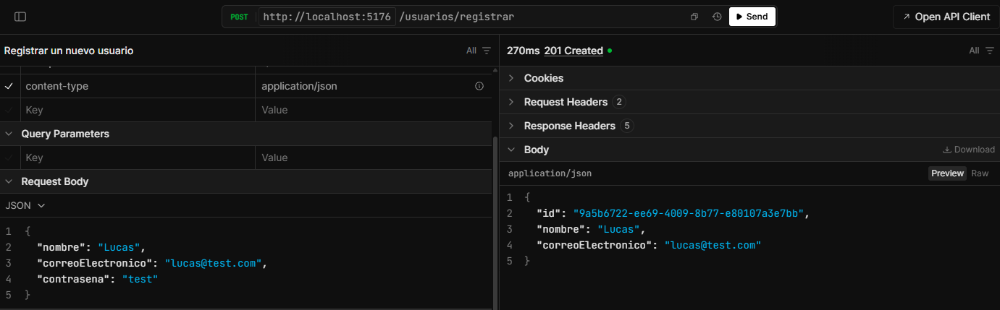

**Iniciar sesión:**

Completar los campos con nombre y contraseña, si las credenciales corresponden a un usuario registrado se recibe un token

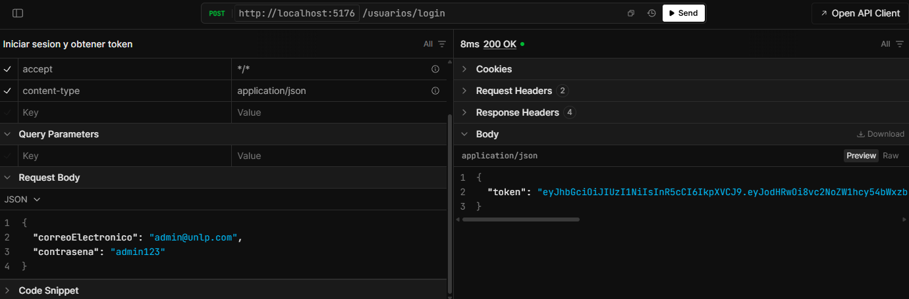

**Modificar mis datos:**

En headers colocar Authorization Bearer -Su token- y en los campos que desea modificar colocar los nuevos datos, dejar en null los que se deseen preservar

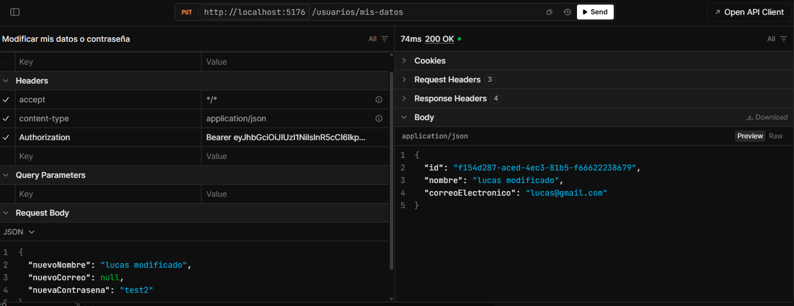

**Listar usuarios:**

En headers colocar Authorization Bearer -Su token-, al ser administrador o tener el permiso correspondiente se listaran todos los usuarios registrados
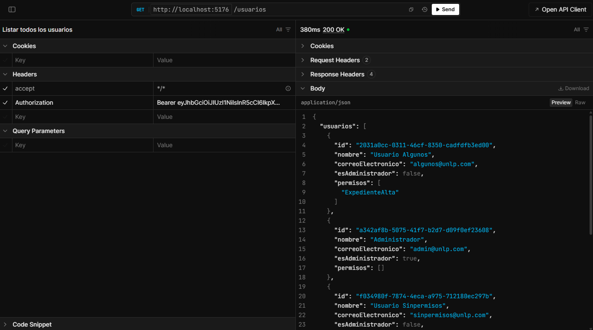
**Eliminar Usuario:**

En variables ID colocar el Id del usuario que se desee eliminar. En headers colocar Authorization Bearer -Su token-, al ser administrador o tener el permiso correspondiente se dará de baja al usuario
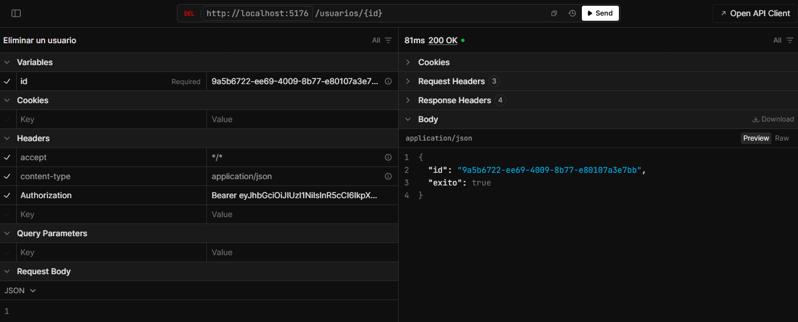
**Modificar Permisos:**

En variables ID colocar el Id del usuario al que se le deseen modificar los permisos. En el request colocar los permisos permitidos por la aplicacion en el formato: ["Ejemplo", "OtroEjemplo"]. En headers colocar Authorization Bearer -Su token-, al ser administrador o tener el permiso correspondiente se modificarán los permisos

**permisos válidos:** ["TramiteAlta","TramiteBaja","TramiteModificacion","TramiteListar","ExpedienteAlta","ExpedienteBaja", "ExpedienteModificacion", "ExpedienteListar", "UsuarioAlta","UsuarioBaja","UsuarioModificacion", "UsuarioListar"]
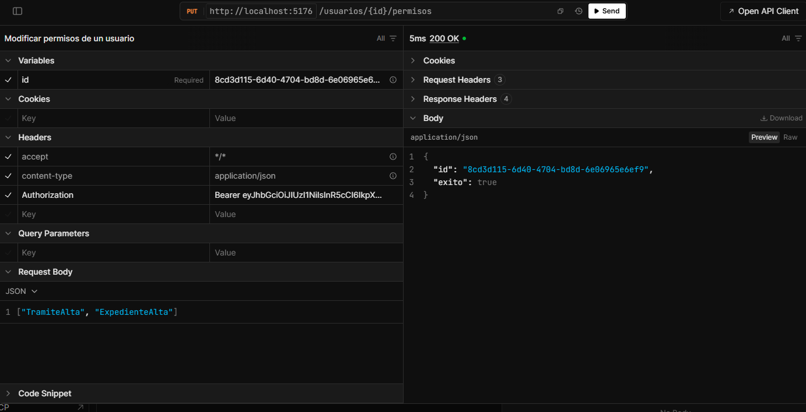
**Crear un expediente:**

En el request ingresar una carátula y el Id asociado al expediente. En los headers colocar Authorization Bearer -Su token-, al ser administrador o tener el permiso correspondiente se creará un nuevo expediente
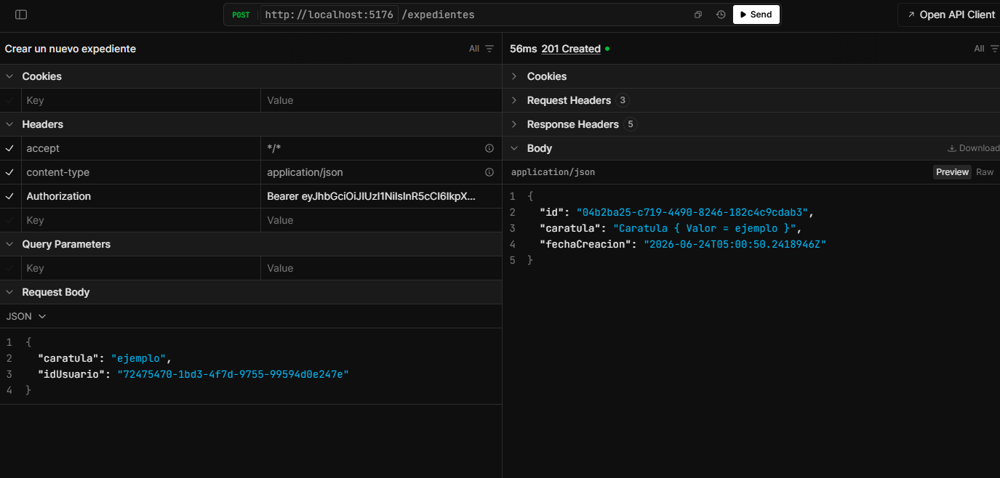

**Listar Expedientes:**

En headers colocar Authorization Bearer -Su token-, al ser administrador o tener el permiso correspondiente se listarán todos los expedientes

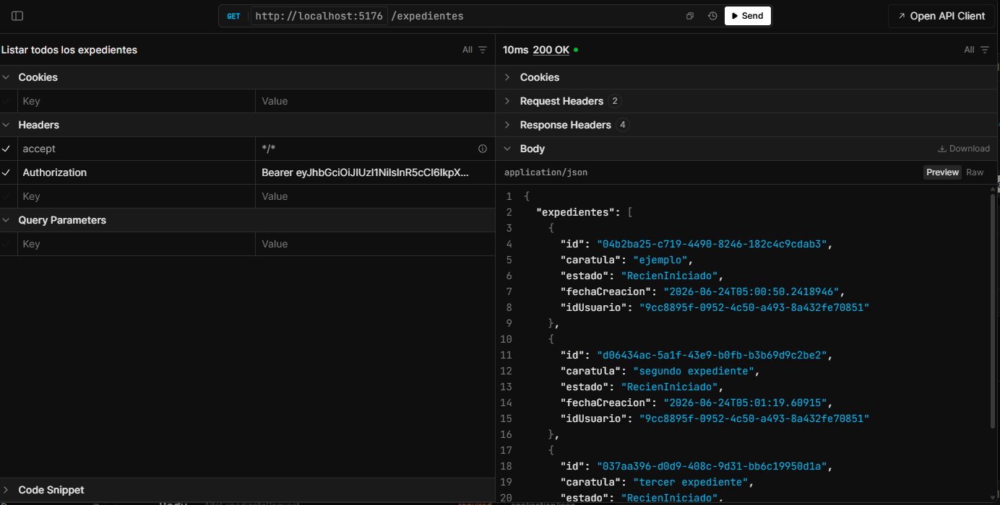

**Eliminar expediente:**

En variables ID colocar el Id de un expediente que se desee eliminar. En los headers colocar Authorization Bearer -Su token-, al ser administrador o tener el permiso correspondiente se dará de baja el expediente junto a sus tramites asociados
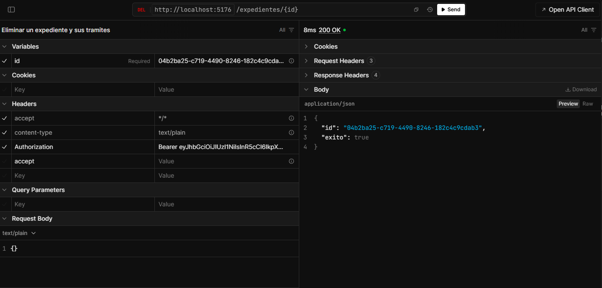
**Modificar caratula expediente:**

En variables ID colocar el Id de un expediente que se desee modificar. En el request llenar el campo con la caratula nueva. En headers colocar Authorization Bearer -Su token-, al ser administrador o tener el permiso correspondiente se concretará la modificación
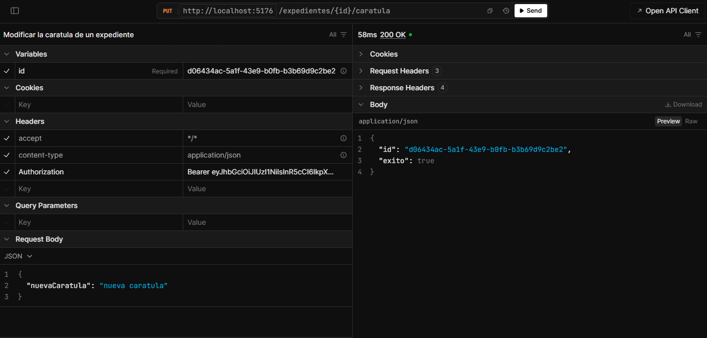

**Crear trámite:**

Rellenar los campos con el id del expediente al que debe asociarse el trámite, una etiqueta valida, contenido y el id del usuario asociado. En headers colocar Authorization Bearer -Su token-, al ser administrador o tener el permiso correspondiente se creará el trámite
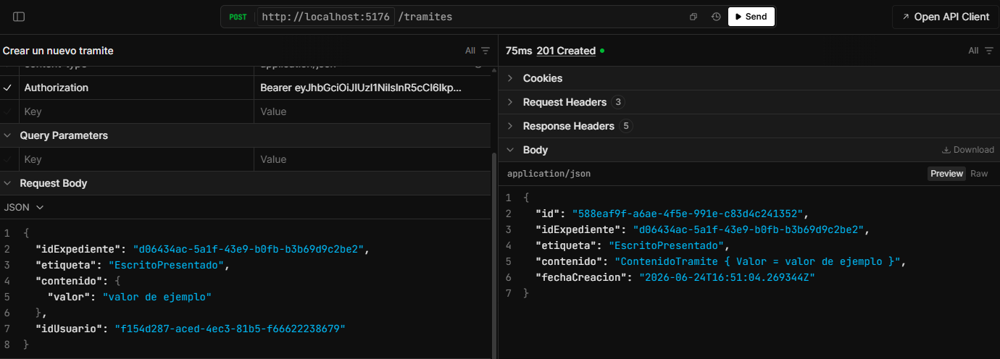

**Listar trámites**

En headers colocar Authorization Bearer -Su token-, al ser administrador o tener el permiso correspondiente se listarán todos los tramites
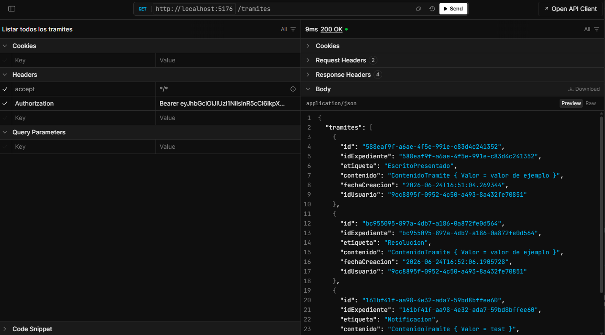

**Listar trámites por expediente**

En variables ID ingresar un Id de expediente válido, en headers colocar Authorization Bearer -Su token-

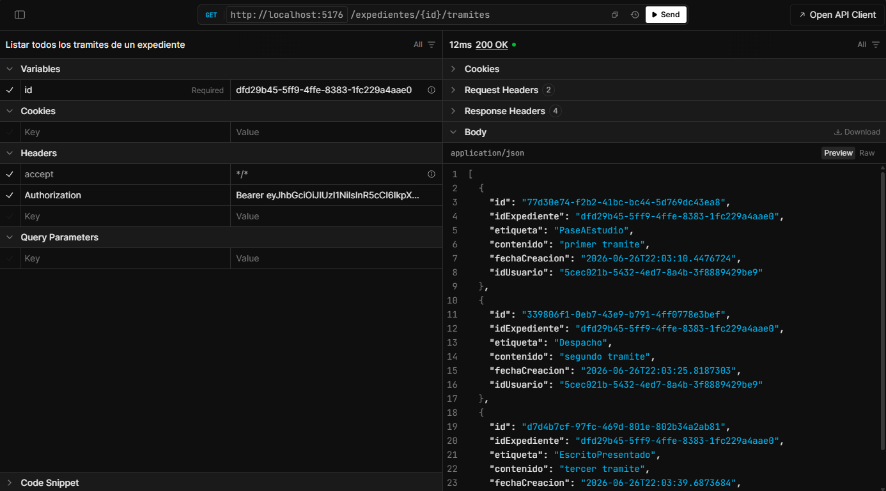

**Listar trámites por expediente en detalle**

En variables ID ingresar un ID de expediente válido, en headers colocar Authorization Bearer -Su token-

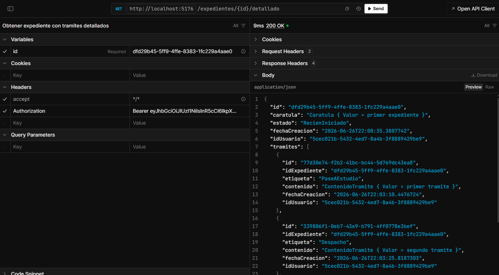

**Eliminar trámite**

En variables ID colocar el id del trámite que desea eliminar. En los headers colocar Authorization Bearer -Su token-, al ser administrador o tener el permiso correspondiente se eliminará el tramite

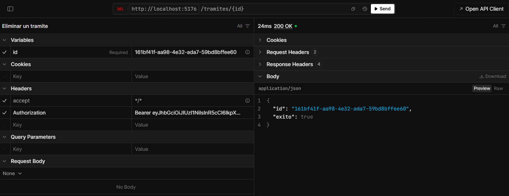
